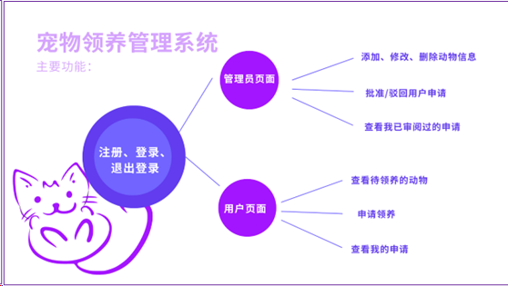
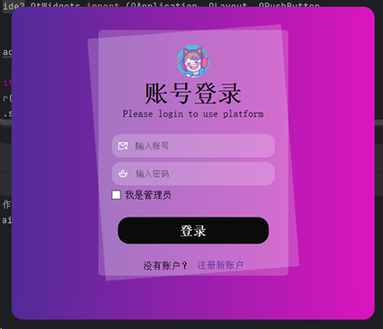

# 宠物领养平台

——哈工大深圳数据库实验作业

## 使用方式：

新建数据库db="petadoption",password="123123"
导入  ./数据库设计/petadoption.sql，执行文件  ./数据库设计/sqlset.sql

源码中的连接方式是：
pymysql.connect(host='localhost', port=3306, user='root', password="123123", db="petadoption")

如果修改数据库名称和密码，同时要改变源码。

配置pyqt5环境，运行  ./petAdoption/main.py

得到下面登录页面，后续操作详细内容请看`宠物领养平台详细功能介绍`

